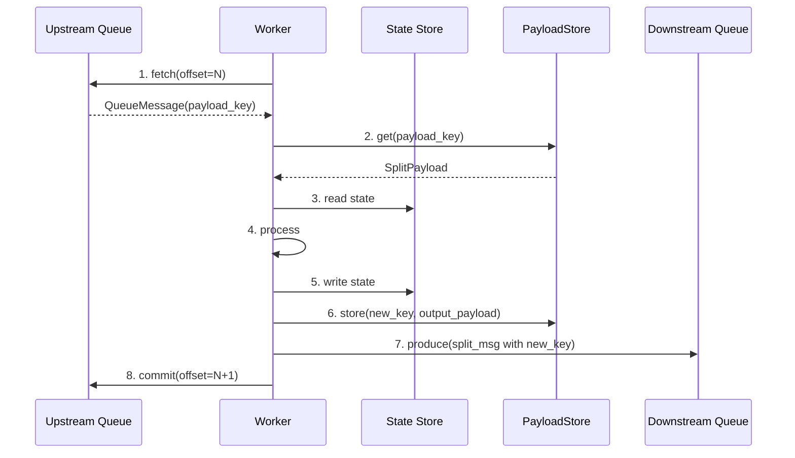
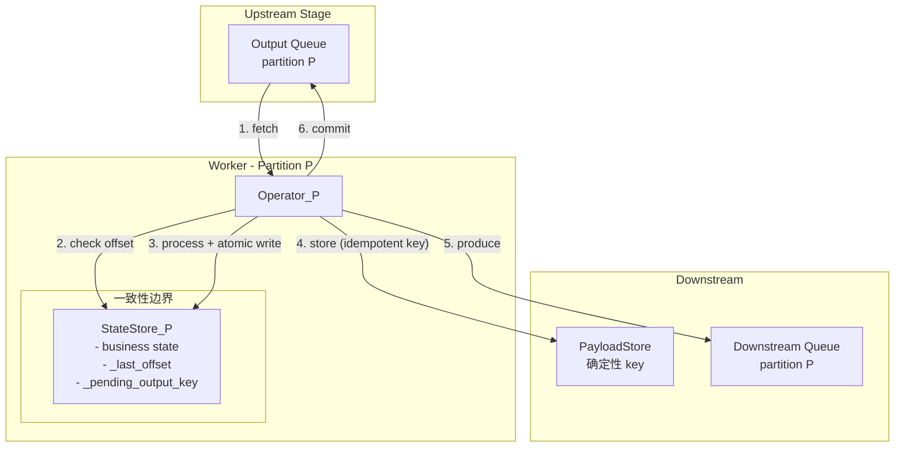
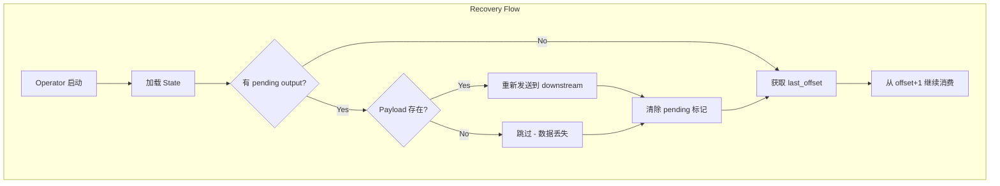

# Solstice Exactly-Once 架构设计 v3

## 问题分析：四方一致性

### 当前数据流



### 四方一致性问题

| 组件 | 作用 | 一致性要求 |

|------|------|-----------|

| **Upstream Queue** | 消费进度 (offset) | 与 state 同步 |

| **State Store** | 业务状态 | 与 offset 同步 |

| **PayloadStore** | 实际数据 (Arrow Table) | 与 downstream msg 同步 |

| **Downstream Queue** | 输出消息 (split_id, payload_key) | 与 payload 同步 |

### 当前设计的关键问题

**问题 1: payload_key 非确定性**

```python
# 当前实现 (stage_worker.py:622)
payload_key = f"{self.worker_id}_{self._processed_count}_{split.split_id}"
#              ^^^^^^^^^^^^^    ^^^^^^^^^^^^^^^^^^^
#              重启后变化        重启后重置为 0
```

如果 worker crash 后重启，相同 split 会生成不同的 payload_key。

**问题 2: PayloadStore 和 Queue 无法原子操作**

```
Crash 场景 A: After store(), before produce()
- PayloadStore 有数据 (orphan)
- Downstream Queue 没有消息
- 重试会产生新的 payload_key → 更多 orphan

Crash 场景 B: After produce(), before commit()
- PayloadStore 有数据
- Downstream Queue 有消息
- Upstream offset 未提交 → 重试产生重复
```

---

## 解决方案：确定性 Key + 幂等操作 + State-Embedded Offset

### 核心设计原则

1. **确定性 Payload Key**：key 由输入唯一确定，重试产生相同 key
2. **State-Embedded Offset**：offset 与 state 原子存储
3. **Downstream Idempotency**：下游基于 split_id 去重
4. **Operator-per-Partition**：简化一致性边界

### 架构图



---

## 详细设计

### 1. 确定性 Payload Key

```python
def generate_payload_key(
    job_id: str,
    stage_id: str, 
    partition_id: int,
    upstream_offset: int,
) -> str:
    """生成确定性的 payload key.
    
    相同的输入总是产生相同的 key，支持幂等重试。
    """
    return f"{job_id}_{stage_id}_p{partition_id}_o{upstream_offset}"


# 使用示例
# 第一次处理 offset=42
payload_key = generate_payload_key("job1", "transform", 0, 42)
# => "job1_transform_p0_o42"

# Worker crash 后重试，仍然是
payload_key = generate_payload_key("job1", "transform", 0, 42)
# => "job1_transform_p0_o42"  (相同！)
```

### 2. PayloadStore 幂等写入

```python
class IdempotentPayloadStore(SplitPayloadStore):
    """支持幂等写入的 PayloadStore."""
    
    def store(self, key: str, payload: SplitPayload) -> str:
        """幂等存储：如果 key 已存在，跳过写入."""
        
        # 检查是否已存在
        existing = self.get(key)
        if existing is not None:
            self.logger.debug(f"Payload {key} already exists, skipping")
            return key
        
        # 不存在则写入
        return self._do_store(key, payload)
    
    def _do_store(self, key: str, payload: SplitPayload) -> str:
        """实际存储逻辑."""
        ref = ray.put(payload, _owner=self._actor)
        return ray.get(self._actor.register.remote(key, {"ref": ref}))
```

### 3. State-Embedded Offset + Pending Output

```python
class PartitionBoundOperator:
    """绑定单个 partition 的 Operator."""
    
    # State keys
    KEY_LAST_OFFSET = b"_last_offset"
    KEY_PENDING_OUTPUT = b"_pending_output_key"
    
    def __init__(self, config: OperatorConfig, partition_id: int):
        self.partition_id = partition_id
        self.state = SlateDBPartitionStateStore(...)
        self.state.acquire_partition(partition_id)
        
        # 恢复时处理 pending output
        self._recover_pending_output()
    
    def _recover_pending_output(self):
        """恢复时检查并完成 pending output."""
        pending_key = self.state.get(self.partition_id, self.KEY_PENDING_OUTPUT)
        if pending_key:
            pending_key = pending_key.decode()
            self.logger.info(f"Found pending output: {pending_key}")
            
            # 检查 payload 是否已在 store 中
            payload = self.payload_store.get(pending_key)
            if payload:
                # Payload 存在，重新发送到下游 queue
                self._produce_to_downstream(pending_key, payload)
            
            # 清除 pending 标记
            self.state.put(self.partition_id, self.KEY_PENDING_OUTPUT, b"")
    
    def process_record(
        self,
        record: QueueMessage,
        upstream_offset: int,
    ) -> Optional[str]:
        """处理单条记录，返回 output payload key."""
        
        # 1. Idempotency check
        last_offset = self._get_last_offset()
        if upstream_offset <= last_offset:
            self.logger.debug(f"Skip duplicate: offset={upstream_offset}")
            return None
        
        # 2. Process
        input_payload = self.payload_store.get(record.payload_key)
        output_payload = self._do_process(record, input_payload)
        
        if output_payload is None:
            # 无输出，只更新 offset
            self.state.put(
                self.partition_id, 
                self.KEY_LAST_OFFSET, 
                upstream_offset.to_bytes(8, 'big')
            )
            return None
        
        # 3. 生成确定性 key
        output_key = generate_payload_key(
            self.config.job_id,
            self.config.stage_id,
            self.partition_id,
            upstream_offset,
        )
        
        # 4. Atomic state write: business state + offset + pending
        writes = [
            *self._get_state_updates(record, output_payload),
            (self.partition_id, self.KEY_LAST_OFFSET, 
             upstream_offset.to_bytes(8, 'big')),
            (self.partition_id, self.KEY_PENDING_OUTPUT, 
             output_key.encode()),
        ]
        self.state.put_batch(writes)
        
        # 5. Store payload (idempotent)
        self.payload_store.store(output_key, output_payload)
        
        # 6. Produce to downstream
        self._produce_to_downstream(output_key, output_payload)
        
        # 7. Clear pending
        self.state.put(self.partition_id, self.KEY_PENDING_OUTPUT, b"")
        
        return output_key
```

### 4. Downstream Idempotency (Belt and Suspenders)

```python
class DownstreamOperator(PartitionBoundOperator):
    """下游 Operator 也进行去重检查."""
    
    KEY_SEEN_SPLITS = b"_seen_"  # prefix for seen split IDs
    
    def process_record(self, record, upstream_offset):
        # 额外检查：这个 split_id 是否已经处理过
        seen_key = self.KEY_SEEN_SPLITS + record.split_id.encode()
        if self.state.get(self.partition_id, seen_key):
            self.logger.debug(f"Skip already seen split: {record.split_id}")
            return None
        
        # 正常处理
        result = super().process_record(record, upstream_offset)
        
        # 记录已处理的 split_id
        if result:
            self.state.put(self.partition_id, seen_key, b"1")
        
        return result
```

---

## 故障恢复流程



### 各种 Crash 场景分析

| Crash 时机 | State 状态 | PayloadStore | Downstream | 恢复行为 | 结果 |

|-----------|-----------|--------------|------------|---------|------|

| Before state write | offset=N-1 | 无 | 无 | 重新处理 N | 正常 |

| After state write | offset=N, pending=key | 无 | 无 | 检测 pending，payload 不存在，跳过 | **数据丢失** |

| After payload store | offset=N, pending=key | 有 | 无 | 检测 pending，重新发送 | 正常 |

| After produce | offset=N, pending=key | 有 | 有 | 检测 pending，重新发送（下游去重） | 正常 |

| After clear pending | offset=N, pending=空 | 有 | 有 | 从 N+1 继续 | 正常 |

**关键问题**：在 "state 写入后，payload 写入前" crash，会丢失这条数据。

### 解决方案：调整写入顺序

```python
def process_record(self, record, upstream_offset):
    # ... 前面逻辑相同 ...
    
    # 关键：先写 payload，再写 state
    
    # 4. Store payload FIRST (idempotent)
    output_key = generate_payload_key(...)
    self.payload_store.store(output_key, output_payload)
    
    # 5. THEN atomic state write
    writes = [
        *self._get_state_updates(record, output_payload),
        (self.partition_id, self.KEY_LAST_OFFSET, offset_bytes),
        (self.partition_id, self.KEY_PENDING_OUTPUT, output_key.encode()),
    ]
    self.state.put_batch(writes)
    
    # 6. Produce to downstream
    self._produce_to_downstream(output_key, output_payload)
    
    # 7. Clear pending
    self.state.put(self.partition_id, self.KEY_PENDING_OUTPUT, b"")
```

新的 Crash 分析：

| Crash 时机 | State | PayloadStore | Downstream | 恢复行为 | 结果 |

|-----------|-------|--------------|------------|---------|------|

| After payload store, before state | offset=N-1 | 有 (orphan) | 无 | 重新处理 N，覆盖相同 key | 正常（有 orphan） |

| After state write | offset=N, pending=key | 有 | 无 | 检测 pending，发送 | 正常 |

| After produce | offset=N, pending=key | 有 | 有 | 检测 pending，发送（去重） | 正常 |

**结论**：调整顺序后，最坏情况是产生 orphan payload，但不会丢数据。

---

## Orphan Payload 清理

由于 "先写 payload 后写 state" 的策略，可能产生 orphan payload。

### GC 策略

```python
class PayloadGarbageCollector:
    """清理无人引用的 payload."""
    
    def collect(self, job_id: str, stage_id: str):
        # 1. 获取所有 state 中的 pending keys
        pending_keys = set()
        for partition in range(self.partition_count):
            pending = self.state.get(partition, KEY_PENDING_OUTPUT)
            if pending:
                pending_keys.add(pending.decode())
        
        # 2. 获取 PayloadStore 中该 stage 的所有 keys
        prefix = f"{job_id}_{stage_id}_"
        all_keys = self.payload_store.list_keys(prefix)
        
        # 3. 获取下游 queue 中引用的 keys
        referenced_keys = self._get_referenced_keys_from_queue()
        
        # 4. 删除未引用且非 pending 的 keys
        for key in all_keys:
            if key not in referenced_keys and key not in pending_keys:
                self.payload_store.delete(key)
```

### 触发时机

- Job 完成时
- Stage 完成时
- 定期 GC（可选）

---

## 完整的处理循环

```python
class PartitionProcessor:
    """单个 partition 的完整处理循环."""
    
    async def run(self):
        # 1. 恢复
        await self._recover()
        
        # 2. 处理循环
        while self._running:
            # Fetch
            records = self.upstream_queue.fetch(
                partition=self.partition_id,
                group_id=self.consumer_group,
            )
            
            for record in records:
                # Process
                output_key = self.operator.process_record(
                    record,
                    upstream_offset=record.offset,
                )
                
                # Commit (after output is guaranteed)
                if output_key or self.operator.should_commit():
                    self.upstream_queue.commit(
                        group=self.consumer_group,
                        offset=record.offset + 1,
                        partition=self.partition_id,
                    )
    
    async def _recover(self):
        """恢复时处理 pending output."""
        pending_key = self.operator.get_pending_output()
        if pending_key:
            payload = self.payload_store.get(pending_key)
            if payload:
                await self._produce_to_downstream(pending_key, payload)
            self.operator.clear_pending()
```

---

## Split ID 设计

### 当前设计

```python
# stage_worker.py:628-632
output_message = QueueMessage(
    message_id=f"{self.worker_id}_{self._processed_count}",
    split_id=f"{self.stage_id}_{message.split_id}",  # 嵌套前缀
    payload_key=payload_key,
    ...
)
```

### 改进：确定性 Split ID

```python
def generate_split_id(
    job_id: str,
    stage_id: str,
    partition_id: int,
    upstream_offset: int,
) -> str:
    """生成确定性的 split ID.
    
    Split ID 和 Payload Key 使用相同的确定性生成策略。
    """
    return f"{job_id}_{stage_id}_p{partition_id}_o{upstream_offset}"


# 这样 split_id == payload_key，简化关联
```

---

## 与现有代码的兼容性

### 需要修改的文件

| 文件 | 修改内容 |

|------|---------|

| `core/stage_worker.py` | 使用确定性 key 生成 |

| `core/split_payload_store.py` | 添加幂等写入检查 |

| `core/operator.py` | 添加 `PartitionBoundOperator` |

| `core/stage_config.py` | 添加 `partition_id` 到 config |

| `state/slatedb_store.py` | 确认 `put_batch` 原子性 |

### 向后兼容

- 无状态 operator：不需要改动，继续使用现有逻辑
- 有状态 operator：迁移到 `PartitionBoundOperator`，使用新的 key 生成策略

---

## 总结：Exactly-Once 保证链

```
┌─────────────────────────────────────────────────────────────────┐
│                    EXACTLY-ONCE GUARANTEE CHAIN                  │
│                                                                  │
│  1. 确定性 Key: payload_key = f(job, stage, partition, offset)   │
│     └─ 重试产生相同 key                                          │
│                                                                  │
│  2. 幂等 PayloadStore: store() 检查 key 是否存在                  │
│     └─ 重复写入不产生新数据                                       │
│                                                                  │
│  3. State-Embedded Offset: state 和 offset 原子更新              │
│     └─ 单个 SlateDB 实例内保证                                   │
│                                                                  │
│  4. Pending Output Recovery: 恢复时完成未完成的发送              │
│     └─ 确保 payload 不丢失                                       │
│                                                                  │
│  5. Downstream Idempotency: 下游基于 split_id 去重               │
│     └─ Belt and suspenders                                       │
│                                                                  │
│  Result: 每条数据处理且仅处理一次                                  │
└─────────────────────────────────────────────────────────────────┘
```

---

## 待确认问题

1. **SlateDB `put_batch` 原子性**：crash 时是否保证原子？
2. **PayloadStore 幂等检查开销**：每次 store 前都检查是否存在，性能影响？
3. **Orphan Payload 清理策略**：GC 频率和触发条件？
4. **Downstream 去重存储**：保留多长时间的 seen split IDs？

---

## 实现优先级

| 优先级 | 任务 | 复杂度 |

|-------|------|--------|

| P0 | 确定性 payload_key 生成 | 低 |

| P0 | State-embedded offset | 中 |

| P1 | Operator-per-partition 重构 | 高 |

| P1 | Pending output recovery | 中 |

| P2 | PayloadStore 幂等写入 | 低 |

| P2 | Downstream idempotency | 中 |

| P3 | Orphan payload GC | 中 |