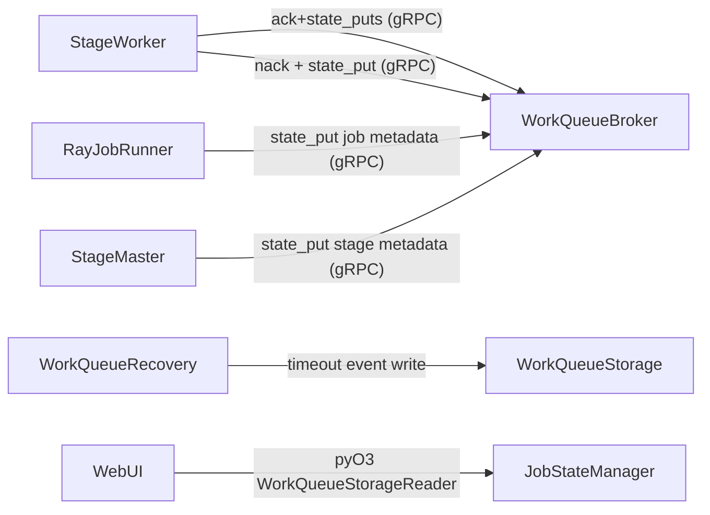

# Nurion WebUI (WorkQueue-First)

> **Note**: API design, schema extensions, and endpoint specification are documented in [webui-api-v2.md](webui-api-v2.md).

## Overview

The WebUI is a lightweight debugging interface that reads job metadata directly from
WorkQueue storage (pyO3) and never relies on push-based state queues or SlateDB.
All writes happen via gRPC calls into the WorkQueue broker; all reads use the storage API.

## Core Principles

1. **Writes via gRPC**: Job/Stage metadata and per-message events are written using
   `state_put` / `state_puts` on WorkQueue gRPC.
2. **Reads via storage API**: WebUI queries WorkQueue storage directly (pyO3) for both
   running jobs and history.
3. **Atomic ack metadata**: `ack` / `ack_and_forward` must carry `state_puts` to keep
   message state and metadata in the same transaction.
4. **No local metrics state**: Worker/master counters are removed; data is derived from
   WorkQueue storage.

## Data Flow



## Storage Schema (WorkQueue state)

### Job Index (global)

- **Namespace**: `jobs`
- **Key**: `job:{job_id}`
- **Value**: `{ job_id, status, start_time, end_time }`

### Job Namespace

- **Namespace**: `job:{job_id}`
- **Keys**:
  - `job` → job summary (stages, dag_edges, status)
  - `config` → job configuration (sanitized)
  - `stage:{stage_id}` → stage status & config snapshot
  - `event:{stage_id}:{ts_ns}:{msg_id}` → per-message events
  - `split:{split_id}` → latest event for a split

### Timeout Events (recovery)

- **Namespace**: `wq_events`
- **Key**: `timeout:{queue}:{ts_ns}:{msg_id}`
- **Value**: `{ event_type=timeout, queue, msg_id, worker_id, lease_id, claimed_at, ... }`

## Event Metadata (ack/nack/timeout)

Written for each message on ack/nack (worker) and timeout (recovery):

```
{
  "event_type": "ack" | "nack" | "timeout",
  "timestamp": <seconds>,
  "timestamp_ns": <ns>,
  "stage_id": "...",
  "worker_id": "...",
  "queue": "...",
  "msg_id": "...",
  "split_id": "...",
  "parent_message_id": "...",
  "source_stage": "...",
  "input_rows": 0,
  "output_rows": 0,
  "input_bytes": 0,
  "output_bytes": 0,
  "processing_ms": 0,
  "queue_wait_ms": 0,
  "reason": "completed" | "payload_missing" | "claim_timeout"
}
```

## Components

- **WorkQueueStateWriter**: gRPC writer used by `RayJobRunner` and `StageMaster`.
- **JobStateManager**: storage reader that aggregates job/stage/worker/event views.
- **EmbeddedWebUIServer**: in-driver WebUI.
- **Portal/History Server**: standalone readers over WorkQueue storage.

## Configuration

### WebUIConfig

```
WebUIConfig(
    enabled: bool = False,
    port: int = 5000,
    lineage_sample_rate: float = 0.0,
)
```

### WorkQueue Storage

WorkQueue DB path is configured in `JobConfig.workqueue_db_path` and is also the
source of truth for WebUI history.

## Notes

- WebUI reads from storage; it never talks to WorkQueue via RPC.
- `ack` / `ack_and_forward` must include `state_puts` in the same RPC for atomicity.
- Timeout events are emitted in recovery (storage write) and surfaced via WebUI.
