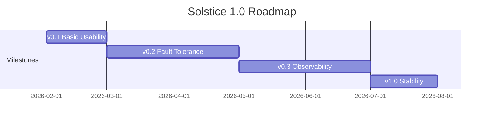

# Solstice 1.0 Roadmap

## Overview

6-month roadmap from basic distributed execution (0.1) to production-ready stable release (1.0).



---

## Milestone 1: v0.1 - Basic Usability (Month 1)

**Goal**: End-to-end distributed pipeline execution on Ray cluster

### Current Features (Ready)

**Core Framework**
- Job/Stage/Operator abstractions with DAG support
- Pull-based queue-driven architecture (Tansu production, Memory testing)
- Ray runtime integration (RayJobRunner, StageMaster, StageWorker)
- Partition management and worker lifecycle

**Data Sources**
- LanceTableSource, IcebergSource, FileSource
- SparkSource V1/V2 (Spark on Ray integration)

**Transform Operators**
- MapOperator, MapBatchesOperator, FlatMapOperator, FilterOperator
- ShuffleOperator, RepartitionOperator (hash-based)

**Advanced Operators**
- HashDedupeOperator (exact dedup via DuckDB + SlateDB)
- MinHash operators (MinHashComputeOperator, CandidatePairOperator)
- Connected Components (CCInitOperator, CCIterateOperator, CCMessageOperator, CCIterateMaster)
- Video processing (FFmpegSceneDetectOperator, FFmpegSliceOperator)
- HTTP/LLM operators

**Data Sinks**
- LanceSink, FileSink, PrintSink

**State Management**
- SlateDBPartitionStateStore (per-partition isolation)
- DuckDB integration for vectorized operations

### v0.1 Remaining Work

- [ ] Integration testing on multi-node Ray cluster
- [ ] Documentation for basic usage and deployment
- [ ] Example workflows for common use cases
- [ ] Basic CI/CD pipeline validation

---

## Milestone 2: v0.2 - Fault Tolerance and Autoscaling (Month 2-3)

**Goal**: Seamless recovery from failures; resource-efficient autoscaling

### 2.1 Fault Tolerance

**Current State**:
- Within-run recovery: Worker failure detection, partition reassignment, exponential backoff
- Exactly-once semantics: Offset-based deduplication via SlateDB
- State recovery: Operator-level state restoration

**v0.2 Work**:

| Feature | Description | Priority |
|---------|-------------|----------|
| Cross-run checkpoint | Periodic checkpoint saving during execution | High |
| Checkpoint application | Load offsets and seek consumers on restart | High |
| Cross-stage coordination | Coordinated recovery across pipeline stages | High |
| Master failure recovery | StageMaster restart handling | Medium |
| Checkpoint validation | Consistency checks, corruption handling | Medium |
| Checkpoint GC | Clean up old checkpoints | Low |

**Key Files**:
- `solstice/checkpoint/storage.py` - Checkpoint storage (scaffolding exists)
- `solstice/checkpoint/recovery.py` - Recovery logic
- `solstice/runtime/ray_runner.py` - Integration point

### 2.2 Autoscaling

**Current State**:
- SimpleAutoscaler with queue lag-based scaling
- Cooldown periods, manual overrides
- Basic resource specification per stage

**v0.2 Work**:

| Feature | Description | Priority |
|---------|-------------|----------|
| Resource availability checks | Check `ray.available_resources()` before scaling | High |
| GPU-aware scaling | Explicit GPU resource constraints | High |
| Worker utilization metrics | Scale based on CPU/GPU utilization | High |
| Bottleneck prioritization | Prioritize stages with highest impact | Medium |
| Multi-stage coordination | Consider downstream backpressure | Medium |
| Predictive scaling | Anticipate load spikes | Low |

**Key Files**:
- `solstice/runtime/autoscaler.py` - Autoscaler implementation
- `solstice/core/managers/backpressure_monitor.py` - Queue lag monitoring

### 2.3 Resource Efficiency (CPU/GPU Mixed)

- Implement `can_spawn_worker()` with resource pre-check
- Add `prioritize_stages()` for resource-constrained scaling
- Track worker utilization (CPU/Memory/GPU) via Ray metrics
- Scale down based on low utilization, not just queue lag

### 2.4 PayloadStore Enhancement

**Current State**:
- Payload (SplitPayload) stored in Ray Object Store only
- No persistence across job restarts
- No GC mechanism for orphaned payloads

**Problem**:
Complete fault tolerance requires three components to be recoverable:
1. **State** (SlateDB) - Operator business state (implemented)
2. **Split Queue** (Tansu) - Message offsets and metadata (implemented)
3. **Payload Store** - Actual data payloads (NOT implemented)

Without persistent PayloadStore, even with checkpoint recovery, payloads are lost on job restart.

**v0.2 Work - PayloadStore Backends**:

| Backend | Description | Use Case | Priority |
|---------|-------------|----------|----------|
| RayObjectStore | Current default, in-memory | Development, small jobs | Existing |
| S3PayloadStore | S3/MinIO object storage | Cloud deployments, durability | High |
| PFSPayloadStore | Parallel File System (Lustre, GPFS) | HPC environments | High |
| NVMePayloadStore | Local NVMe with replication | High-throughput, low-latency | Medium |
| HybridPayloadStore | Tiered: NVMe (hot) + S3 (cold) | Cost-optimized durability | Medium |

**PayloadStore Protocol**:

```python
class PayloadStore(Protocol):
    async def put(self, payload_id: str, data: bytes) -> None: ...
    async def get(self, payload_id: str) -> bytes: ...
    async def delete(self, payload_id: str) -> None: ...
    async def exists(self, payload_id: str) -> bool: ...
    async def list_prefix(self, prefix: str) -> list[str]: ...
```

**v0.2 Work - Payload GC**:

| Feature | Description | Priority |
|---------|-------------|----------|
| Reference tracking | Track payload references across stages | High |
| Downstream ACK | Delete payload after all consumers ACK | High |
| TTL-based cleanup | Delete payloads older than TTL | High |
| Orphan detection | Find payloads with no references | Medium |
| Background GC | Periodic cleanup without blocking | Medium |
| GC metrics | Track storage usage, cleanup rate | Medium |

**GC Strategy**:

```
1. Split metadata includes payload_id
2. When consumer commits offset, record payload as "consumed by stage X"
3. When ALL downstream stages have consumed, mark payload for deletion
4. Background GC deletes marked payloads after grace period
5. On job restart, scan for orphaned payloads (no active references)
```

**Recovery Flow with PayloadStore**:

```
Job Restart:
1. Load checkpoint (offsets per stage/partition)
2. For each stage:
   a. Seek queue consumer to checkpoint offset
   b. Verify payloads exist in PayloadStore
   c. If payload missing, request re-send from upstream
3. Resume processing
```

**Key Design Decisions**:
- PayloadStore is pluggable via `JobConfig.payload_store`
- Default: RayObjectStore (backward compatible)
- Payload ID format: `{job_id}/{stage_id}/{partition_id}/{offset}`
- Payloads are immutable once written
- GC is opt-in, disabled by default for development

---

## Milestone 3: v0.3 - Observability and Rich Operators (Month 4-5)

**Goal**: Comprehensive debugging via WebUI; rich built-in operators; DataFrame-like API

### 3.1 WebUI Enhancements

**Current State**:
- Portal and History Server (unified read-only architecture)
- Basic pages: Job/Stage/Worker detail, Exceptions, Configuration
- Push-based metrics via Tansu to SlateDB

**v0.3 Work**:

| Feature | Description | Priority |
|---------|-------------|----------|
| SSE real-time updates | `/sse/metrics` for live refresh | High |
| Grafana iframe integration | Embed Grafana dashboards | High |
| Stage DAG visualization | Graphical pipeline view (Dagre + D3.js) | High |
| Lineage visualization | Split lineage graph | High |
| Time-series charts | Throughput, lag, resource usage (Chart.js) | High |
| Backpressure visualization | Bottleneck analysis | Medium |
| Data skew detection display | Partition-level skew alerts | Medium |
| Worker resource monitoring | CPU/Memory/GPU charts | Medium |
| Timeline events | EventCollector implementation | Medium |
| Checkpoints page | Checkpoint history and status | Medium |

**Key Files**:
- `solstice/webui/api/` - API endpoints
- `solstice/webui/templates/` - Jinja2 templates
- `solstice/webui/storage/` - Storage backends

### 3.2 Logging and Metrics Integration

| Feature | Description | Priority |
|---------|-------------|----------|
| Structured logging | JSON logs with trace IDs | High |
| Log aggregation in WebUI | Search and filter logs | High |
| Prometheus metrics | Comprehensive metric export | High |
| Grafana dashboard templates | Pre-built dashboards | Medium |
| Alert rule examples | Prometheus alerting rules | Medium |

### 3.3 AI-Assisted Analysis

| Feature | Description | Priority |
|---------|-------------|----------|
| Exception pattern analysis | Group similar exceptions | Medium |
| Performance anomaly detection | Identify unusual patterns | Medium |
| Root cause suggestions | AI hints for common issues | Low |
| Resource optimization recommendations | Suggest parallelism tuning | Low |

### 3.4 Post-Mortem Analysis

- History Server for completed jobs
- Metrics snapshots (30s granularity)
- Exception aggregation with stacktraces
- Split lineage tracing

### 3.5 Built-in Multimodal Operators

**Current State**:
- Video: FFmpegSceneDetectOperator, FFmpegSliceOperator
- Basic transform: Map, Filter, FlatMap, Repartition

**v0.3 Work - Video Operators**:
- VideoDecodeOperator: Decode video to frames (PyAV/FFmpeg)
- VideoEncodeOperator: Encode frames to video
- FrameSampleOperator: Sample frames at intervals or keyframes
- VideoResizeOperator: Resize/crop video frames
- VideoFilterOperator: Apply FFmpeg filters (blur, denoise, etc.)
- VideoMetadataOperator: Extract video metadata (duration, fps, codec)

**v0.3 Work - Image Operators**:
- ImageDecodeOperator: Decode images (PIL/OpenCV)
- ImageEncodeOperator: Encode to various formats (JPEG, PNG, WebP)
- ImageResizeOperator: Resize/crop/pad images
- ImageTransformOperator: Rotate, flip, color adjustments
- ImageFilterOperator: Blur, sharpen, edge detection
- ImageAugmentOperator: Data augmentation (for ML training)
- OCROperator: Text extraction from images (Tesseract/PaddleOCR)

**v0.3 Work - Audio Operators**:
- AudioDecodeOperator: Decode audio files (librosa/soundfile)
- AudioEncodeOperator: Encode to various formats (MP3, WAV, FLAC)
- AudioResampleOperator: Resample audio to target sample rate
- AudioSplitOperator: Split audio by silence/duration
- AudioMergeOperator: Concatenate audio segments
- SpeechToTextOperator: Transcription (Whisper integration)
- AudioFeatureOperator: Extract features (MFCC, spectrograms)

### 3.6 Complex Data Operators

**v0.3 Work - Join Operators**:
- HashJoinOperator: Distributed hash join (shuffle-based)
- BroadcastJoinOperator: Broadcast small table to all workers
- SortMergeJoinOperator: Sort-merge join for large tables
- CoPartitionedJoinOperator: Optimized join for pre-partitioned data
- Support join types: INNER, LEFT, RIGHT, FULL, SEMI, ANTI

**v0.3 Work - Set Operators**:
- UnionOperator: Combine multiple streams (preserves duplicates)
- UnionAllOperator: Alias for Union
- IntersectOperator: Records present in all inputs
- ExceptOperator: Records in first input but not in others
- DistinctOperator: Remove duplicates (global dedup)

**v0.3 Work - Aggregation Operators**:
- GroupByOperator: Group by key with aggregation functions
- WindowOperator: Sliding/tumbling window aggregations
- GlobalAggregateOperator: Full dataset aggregation
- Built-in aggregations: count, sum, avg, min, max, first, last, collect_list

### 3.7 DataFrame-like API

**Design Goals**:
- Fluent, chainable API similar to Pandas/Spark DataFrame
- Type-safe with IDE autocompletion
- Lazy evaluation with optimization

**API Example**:

```python
from solstice import DataFrame

# Create DataFrame from source
df = DataFrame.from_lance("/data/videos")

# Fluent transformations
result = (
    df
    .filter(lambda row: row["duration"] > 60)
    .map(lambda row: {**row, "processed": True})
    .select("id", "url", "processed")
    .repartition(num_partitions=16, key="id")
    .join(metadata_df, on="id", how="left")
    .group_by("category")
    .agg(count="*", avg_duration="duration")
    .sort_by("count", descending=True)
    .limit(100)
)

# Execute
await result.to_lance("/data/output")
```

**Key Components**:
- `DataFrame` class: Lazy representation of transformations
- `DataFrameReader`: Read from various sources
- `DataFrameWriter`: Write to various sinks
- Query optimizer: Predicate pushdown, projection pruning
- Automatic stage generation from DataFrame operations

**Implementation**:
- DataFrame builds internal DAG of operations
- `to_*()` methods trigger Job/Stage generation
- Each operation maps to underlying Operator
- Optimizer rewrites DAG before execution

---

## Milestone 4: v1.0 - Stability (Month 6)

**Goal**: Production-ready release with stable APIs and comprehensive bug fixes

### 4.1 Stability Work

| Area | Description |
|------|-------------|
| Bug fixes | Address issues discovered in 0.1-0.3 |
| Architecture cleanup | Resolve technical debt |
| Performance optimization | Bottleneck elimination |
| Memory leak fixes | Long-running job stability |
| Edge case handling | Graceful degradation |

### 4.2 API Stabilization

| Area | Description |
|------|-------------|
| Public API freeze | No breaking changes after 1.0 |
| Deprecation policy | Clear upgrade path |
| API documentation | Comprehensive docstrings |
| Migration guide | From 0.x to 1.0 |

### 4.3 Production Validation

| Area | Description |
|------|-------------|
| Internal workloads | Run production pipelines |
| Load testing | High-throughput scenarios |
| Chaos testing | Failure injection at scale |
| Performance benchmarks | Documented baselines |

### 4.4 Documentation

| Area | Description |
|------|-------------|
| User guide | End-to-end tutorials |
| Operator reference | All built-in operators |
| Deployment guide | Ray cluster setup |
| Troubleshooting guide | Common issues and solutions |

---

## Summary Timeline

| Milestone | Duration | Key Deliverables |
|-----------|----------|------------------|
| **v0.1** | Month 1 | Basic distributed execution, end-to-end pipelines |
| **v0.2** | Month 2-3 | Cross-run checkpoint recovery, resource-aware autoscaling, GPU/CPU mixed workloads, PayloadStore (S3/PFS/NVMe) with GC |
| **v0.3** | Month 4-5 | Grafana integration, real-time WebUI, multimodal operators (video/image/audio), complex operators (join/union/groupby), DataFrame API |
| **v1.0** | Month 6 | Stable APIs, bug fixes, production validation, documentation |

---

## Risk Mitigation

| Risk | Mitigation |
|------|------------|
| Checkpoint complexity | Start with simple offset-based recovery, iterate |
| Autoscaling edge cases | Extensive testing with varied workloads |
| WebUI performance | Pagination, virtual scrolling for large datasets |
| API stability | Feature freeze 2 weeks before 1.0 |

---

*Last updated: 2026-01-28*
